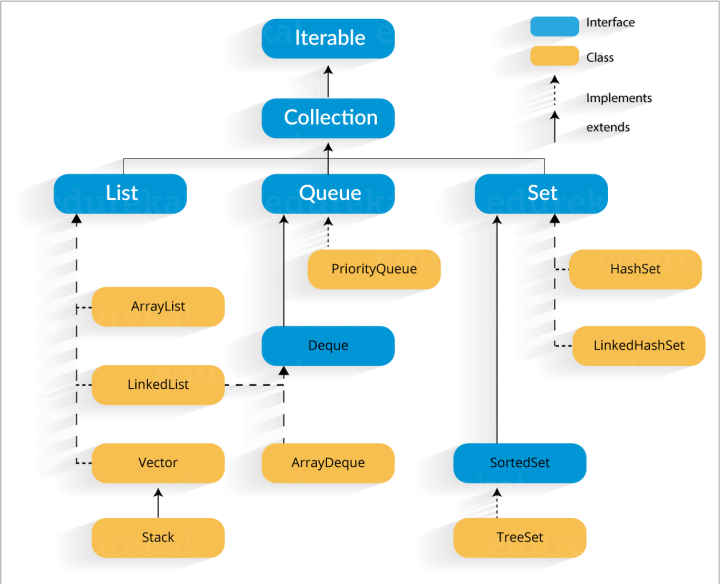

<h3 dir="rtl" align="center">
COLLECTION در جاوا
</h3>

---

interface های collection :
 
Set, List, Queue, Deque,…
 
class های collection :
 
ArrayList, Vector, LinkedList, PriorityQueue, HashSet, LinkedHashSet, TreeSet ,…

  

